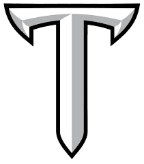

# ⌚ Titan Watches — Modern Watch Store Website

<p align="center">
  
</p>

<p align="center">
  <b>A modern, responsive and SEO-friendly watch store website inspired by Titan Watches.</b>
</p>

<p align="center">
  <a href="#-features">Features</a> •
  <a href="#-seo-optimization">SEO</a> •
  <a href="#-technologies-used">Technologies</a> •
  <a href="#-project-structure">Structure</a> •
  <a href="#-installation">Installation</a>
</p>

---

## 🌐 About The Project

**Titan Watches** is a modern e-commerce-style watch website created using **HTML and CSS**, inspired by the design and shopping experience of Titan's official watch store.

The project focuses on creating a clean user interface, responsive layouts, organized product categories, and an **SEO-friendly website structure**.

This project was developed as a frontend web development project to practice:

* Modern website design
* Responsive layouts
* Product category pages
* Semantic HTML
* Search Engine Optimization (SEO)
* Website navigation
* Clean and reusable CSS

---

## ✨ Features

### 🛍️ Watch Categories

* ⌚ All Watches
* 👨 Men's Watches
* 👩 Women's Watches
* 📞 Contact Page
* 🏠 Home Page

### 🎨 User Interface

* Clean and modern design
* Professional watch-store layout
* Easy navigation
* Product-focused interface
* Consistent branding
* Responsive page structure

### 📱 Responsive Design

The website is designed to provide a better browsing experience across:

* 💻 Desktop
* 💻 Laptop
* 📱 Mobile
* 📟 Tablet

---

## 🚀 SEO Optimization

One of the main goals of this project is to implement **Search Engine Optimization (SEO)** techniques.

The website structure is designed with SEO in mind, including:

* 🔍 SEO-friendly page titles
* 📝 Meta descriptions
* 🏷️ Relevant meta keywords where applicable
* 🧩 Semantic HTML structure
* 🖼️ Descriptive image `alt` attributes
* 🔗 Clean internal navigation
* 📄 Individual pages for different watch categories
* 📱 Mobile-friendly structure
* ⚡ Lightweight frontend implementation
* 📌 Descriptive headings and page content

### SEO Pages

The project contains separate pages for different website sections:

```text
/
├── index.html
├── all-watches.html
├── mens-watches.html
├── womens-watches.html
└── contact.html
```

This structure helps search engines understand the website content and its different sections more clearly.

> **Note:** This project is an educational frontend implementation inspired by Titan Watches and is not affiliated with or officially connected to Titan Company Limited.

---

## 🛠️ Technologies Used

| Technology | Purpose                      |
| ---------- | ---------------------------- |
| 🌐 HTML5   | Website structure            |
| 🎨 CSS3    | Styling and layout           |
| 🔍 SEO     | Search engine optimization   |
| 🖼️ Images | Product and branding visuals |

---

## 📂 Project Structure

```text
Titan-Watches/
│
├── index.html              # Home page
├── all-watches.html        # All watches page
├── mens-watches.html       # Men's watches
├── womens-watches.html     # Women's watches
├── contact.html            # Contact page
├── styles.css              # Main stylesheet
├── tlogo.png               # Website logo
└── README.md               # Project documentation
```

---

## ⚙️ Installation

### 1. Clone the repository

```bash
git clone https://github.com/GohilVijay07/Titan-Watches.git
```

### 2. Open the project

```bash
cd Titan-Watches
```

### 3. Run the website

Since this is a frontend HTML/CSS project, you can simply open:

```text
index.html
```

in your browser.

### Recommended

You can also use **VS Code Live Server** for a better development experience.

---

## 🖥️ Website Pages

### 🏠 Home

The main landing page introducing the watch collection and website.

### ⌚ All Watches

Displays the complete collection of available watches.

### 👨 Men's Watches

Dedicated page for men's watch collections.

### 👩 Women's Watches

Dedicated page for women's watch collections.

### 📞 Contact

Provides a dedicated contact section/page.

---

## 🎯 Project Goals

The main objectives of this project are:

1. Build a professional-looking watch store website.
2. Practice HTML5 and CSS3.
3. Create multiple interconnected web pages.
4. Implement SEO-friendly website practices.
5. Improve responsive web design skills.
6. Understand website structure and navigation.
7. Create a portfolio-ready frontend project.

---

## 📸 Screenshots

> Add screenshots of your website here to showcase the UI.

Example:

```markdown


```

---

## 🔮 Future Improvements

Possible future enhancements include:

* 🛒 Shopping cart functionality
* ❤️ Wishlist system
* 🔐 User authentication
* 💳 Online payment integration
* 🔎 Product search
* 🎛️ Product filtering and sorting
* 📦 Product detail pages
* 🗄️ Backend integration
* 📊 Database integration
* 📱 Improved mobile experience
* 🌙 Dark mode
* ⚡ Further performance optimization
* 📈 Advanced technical SEO
* 🗺️ XML sitemap
* 🤖 Robots.txt
* 📊 Google Search Console integration

---

## ⚠️ Disclaimer

This project is created for **educational and portfolio purposes**.

It is inspired by the concept and design language of a watch e-commerce website. It is **not an official Titan Watches website** and is not affiliated with Titan Company Limited.

All trademarks, logos, product names and brand assets belong to their respective owners.

---

## 👨‍💻 Developer

### Vijay Gohil

Frontend Web Developer | Python Developer | AI & Web Development Enthusiast

**GitHub:**
https://github.com/GohilVijay07

---

## ⭐ Support

If you found this project useful or interesting, consider giving it a ⭐ on GitHub.

Your support helps motivate me to build more projects! 🚀

---

<p align="center">
  Made with ❤️ by <b>Vijay Gohil</b>
</p>
